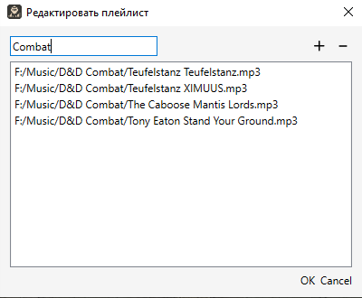

# DM-assist
Инструмент в помощь мастерам в настольных ролевых играх

# Краткое описание
Этот инструмент вырос из идеи, что делать несколько кликов для переключения музыки во время настольной ролевой игры неудобно.
Постепенно проект обрастал новыми функциями, в итоге вылившись в более удобный, современный и интуитивно-понятный аналог
DM helper.


# Поддержка
- Windows 10
- Linux (собрано под Ubuntu)

# Установка
Перейдите на страницу [релизов](https://github.com/Technohamster-py/dm-assist/releases), выберите нужную версию 
(рекомендуется последний стабильный), скачайте установщик / портативный zip архив (для windows) или tar.gz архив (linux) 

## Туториал:
### Настройки
Настройки можно открыть через паннель меню ```Кампания -> Настройки``` или использовав шорткат ```ctrl+alt+s```

#### Общие

- **Язык** определяет локализацию приложения. Из коробки доступны русская и английская версии.
[Как добавить новую локализацию](https://github.com/Technohamster-py/dm-assist/wiki/%D0%A1%D0%BE%D0%B7%D0%B4%D0%B0%D0%BD%D0%B8%D0%B5-%D0%BD%D0%BE%D0%B2%D0%BE%D0%B9-%D0%BB%D0%BE%D0%BA%D0%B0%D0%BB%D0%B8%D0%B7%D0%B0%D1%86%D0%B8%D0%B8)
- **Аудио выход** определяет устройство, на котором будет воспроизводиться музыка из плееров.
Используя [виртуальный кабель](https://vb-audio.com/Cable/) можно подключить аудиовыход к микрофону discord и 
транслировать музыку при онлайн-игре.
- **Рабочая папка** определяет, в какой папке будут храниться временные файлы, необходимые для работы программы.

#### Внешний вид

- **Тема** определяет тему приложения. По нажатию кнопки _обзор_ можно выбрать новую, не предустановленную тему в формате 
файла xml. Файл будет скопирован в папку программы и в дальнейшем тема будет доступна из меню настроек.

#### Трекер инициативы

- **Поля в совместном доступе** - определяет, какие поля трекера будут показаны в окне, предназначенном для игроков.
[подробнее](#совместный-доступ).
- **Режим отображения хитов** - определяет, как будет отображаться здоровье персонажей в окне, предназначенном для игроков
[подробнее](#режимы-отображения-hp)

### Музыка
Нажмите ▶ чтобы запустить проигрывание. Так же можно использовать шорткат ```ctrl + номер_плейлиста```. Номер для 
удобства указан слева от названия плейлиста.

Каждый плейлист можно регулировать по громкости независимо от других, используя персональный слайдер. Так же можно
регулировать общий уровень громкости, используя общий большой слайдер, расположенный под всеми плеерами.


Нажмите 🖊 чтобы открыть окно редактирования плейлиста. Здесь вы можете задать отображаемое название, добавлять (+),
удалять (выберите и нажмите -) и менять местами (зажмите и перетащите) треки.
После закрытия диалога выбранные файлы скопируются в рабочую папку программы. После закрытия программы данная папка
очищается. 



### Трекер инициативы


#### Совместный доступ
#### Режимы отображения HP
### Карта
### Кампании
### Редактор персонажей

## Планируемые функции и поддерживаемые игровые системы
### D&D 5e
- Хранилище персонажей
- - Быстрое поднятие уровня для персонажей (сразу предлагается выбор того, что добавляется на новом уровне)
  - Возможность делать персонажа с мультиклассом
### D&D 2024
### Call of Cthulhu
### Cyberpunk (RED, 2020)
### World of Darkness (MtA, VtM etc.)
### Pathfinder
### Starfinder