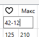
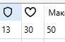
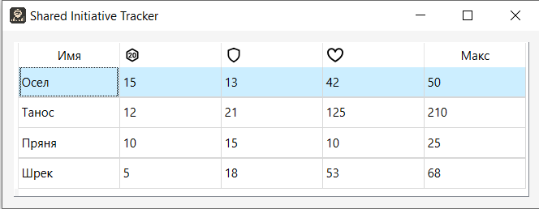
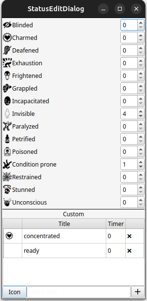
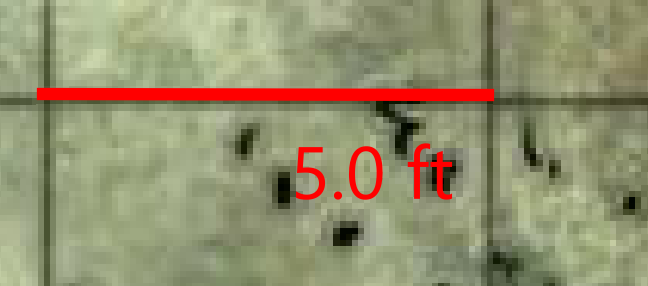
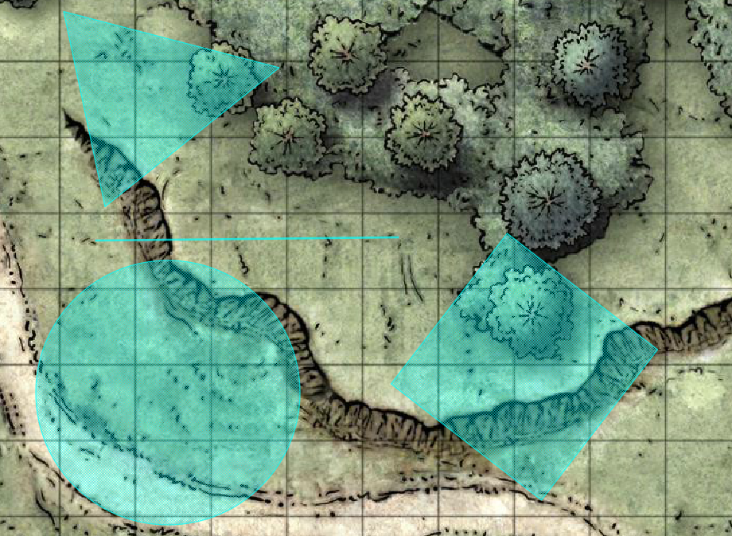
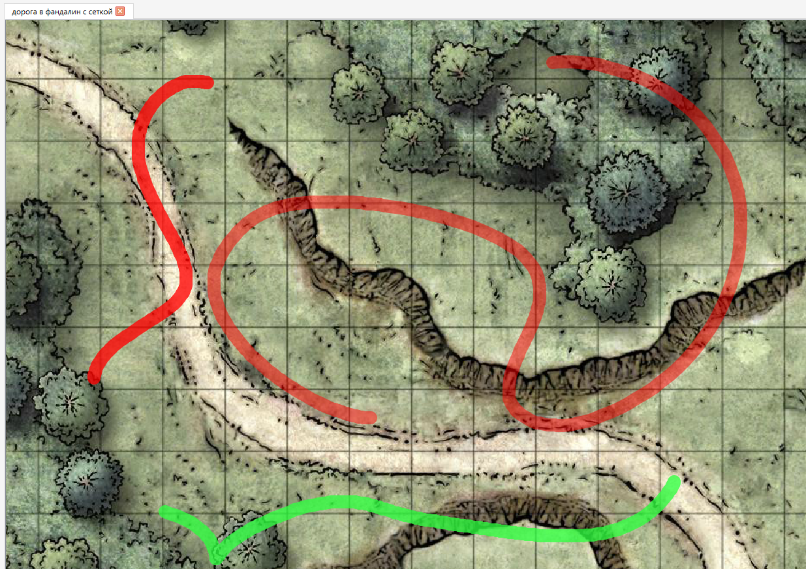
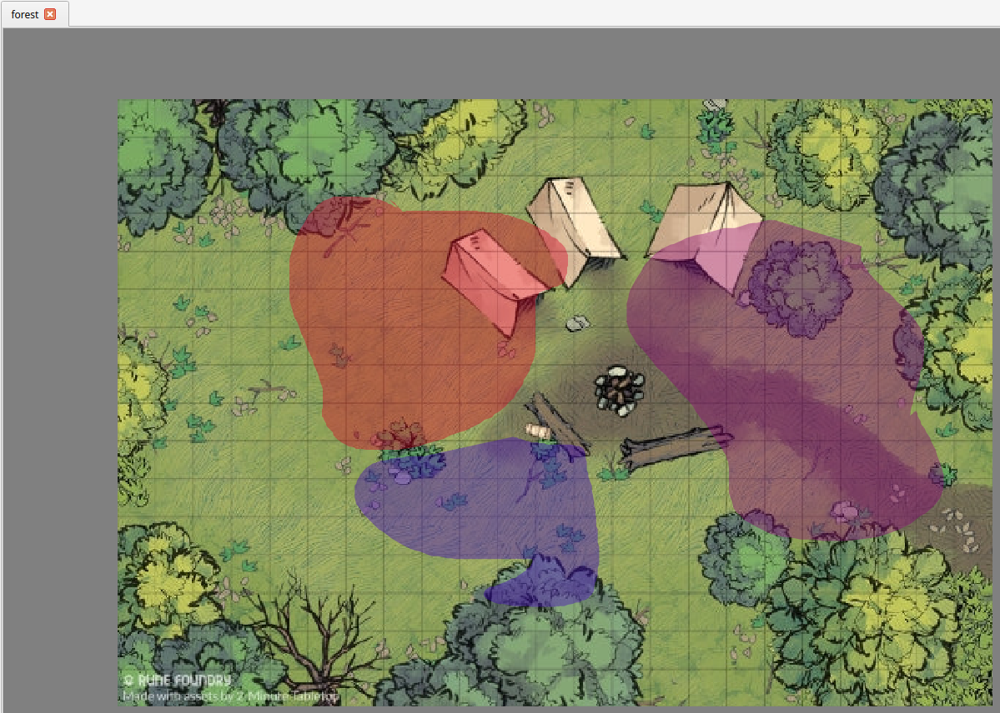
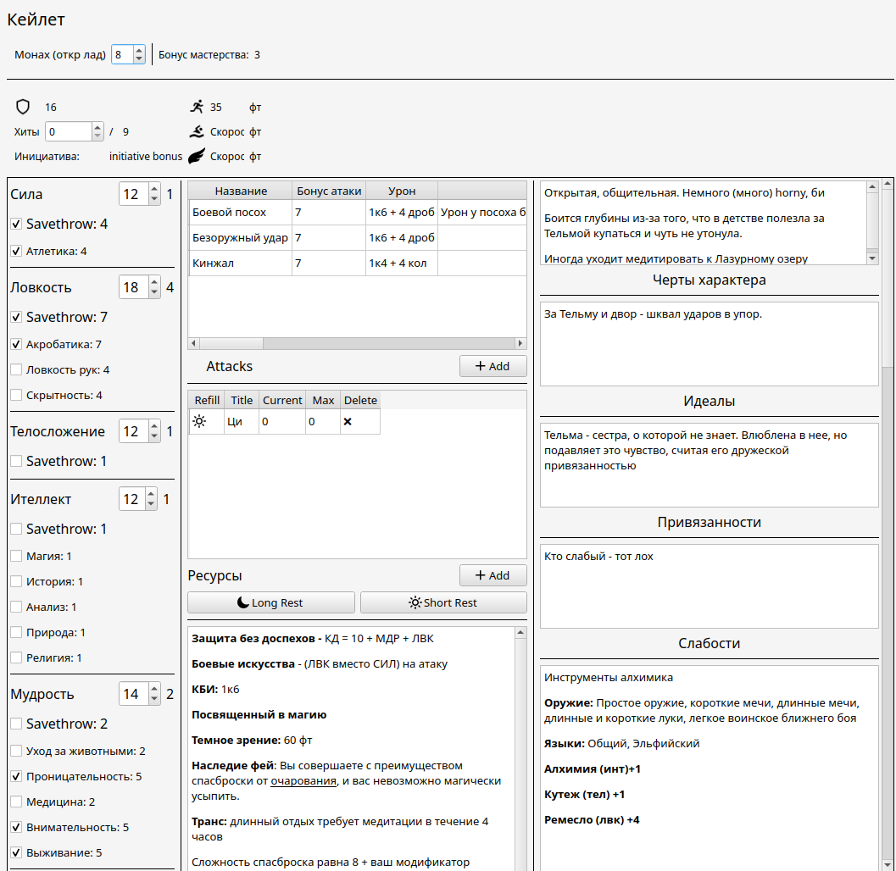
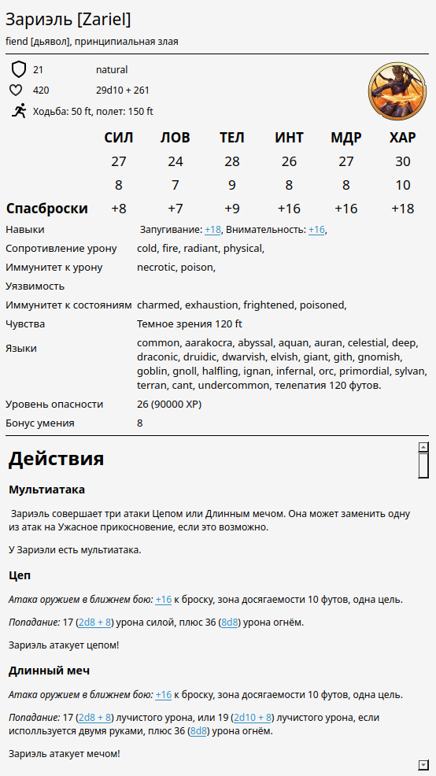

# DM-assist
Инструмент в помощь мастерам в настольных ролевых играх

# Благодарности
Спасибо [TTG Club](https://ttg.club/) за иконки, примененные в таблице инициативы!

Вы можете помочь проекту [здесь](https://technohamster.taplink.ws). Это добровольно и никак не влияет на функционал приложения.

# Краткое описание
Этот инструмент вырос из идеи, что делать несколько кликов для переключения музыки во время настольной ролевой игры неудобно.
Постепенно проект обрастал новыми функциями, в итоге вылившись в более удобный, современный и интуитивно-понятный аналог
DM helper.


# Оглавление
- [Поддержка](#поддержка)
- [Установка](#установка)
- [Туториал](#туториал)
  - [Настройки](#настройки)
  - [Музыка](#музыка)
  - [Трекер инициативы](#трекер-инициативы-1)
  - [Карта](#карта)
  - [Кампании](#кампании)
  - [Редактор персонажей](#редактор-персонажей)
- [Планируемые функции](#планируемые-функции-и-поддерживаемые-игровые-системы)

# Поддержка
- Windows 10/11
- Linux (собрано под Ubuntu)

# Установка
Перейдите на страницу [релизов](https://github.com/Technohamster-py/dm-assist/releases), выберите нужную версию 
(рекомендуется последний стабильный), скачайте установщик / (для windows) или tar.gz архив (linux)

В случае установщика запустите файл и следуйте инструкциям. В случае архива распакуйте его в выбранную папку и запустите
Исполняемый файл DM-assist

# Туториал:
## Настройки
Настройки можно открыть через паннель меню ```Кампания -> Настройки``` или использовав шорткат ```ctrl+alt+s```

### Общие

- **Язык** определяет локализацию приложения. Из коробки доступны русская и английская версии.
[Как добавить новую локализацию](https://github.com/Technohamster-py/dm-assist/wiki/%D0%A1%D0%BE%D0%B7%D0%B4%D0%B0%D0%BD%D0%B8%D0%B5-%D0%BD%D0%BE%D0%B2%D0%BE%D0%B9-%D0%BB%D0%BE%D0%BA%D0%B0%D0%BB%D0%B8%D0%B7%D0%B0%D1%86%D0%B8%D0%B8)
- **Аудио выход** определяет устройство, на котором будет воспроизводиться музыка из плееров.
Используя [виртуальный кабель](https://vb-audio.com/Cable/) можно подключить аудиовыход к микрофону discord и 
транслировать музыку при онлайн-игре.
- **Рабочая папка** определяет, в какой папке будут храниться временные файлы, необходимые для работы программы.
- **Действие при старте** определяет поведение приложения при запуске
- **Проверять обновления при старте** - если включено - приложение будет проверять обновления при запуске и покажет, если есть более актуальная версия

### Внешний вид

- **Тема** определяет тему приложения. По нажатию кнопки _обзор_ можно выбрать новую, не предустановленную тему в формате 
файла xml. Файл будет скопирован в папку программы и в дальнейшем тема будет доступна из меню настроек.
- **Стиль** определяет стиль отрисовки графических элементов интерфейса. **_Рекомендуемый стиль - fusion_**

### Трекер инициативы

- **Поля в совместном доступе** - определяет, какие поля трекера будут показаны в окне, предназначенном для игроков.
[подробнее](#совместный-доступ).
- **Режим отображения хитов** - определяет, как будет отображаться здоровье персонажей в окне, предназначенном для игроков
[подробнее](#режимы-отображения-hp)
- **Автоматические броски инициативы** - при добавлении персонажа в энкаунтер автоматически устанавливается случайное значения инициативы
- **Автоматическая сортировка** - если включена, то скрывает кнопку ручной сортировки и обновляет трекер при изменении значения в поле инициативы у любого из персонажей
- **Цвет активного персонажа** - Можно задать свой или же использовать включенный в палитру

### Карта

- *Режим имен токенов** и **Размер шрифта токенов** отвечают за режим и параметры отрисовки подписей с именами к токенам персонажей на карте (подробнее в разделе [Токены](#использование-токенов))

### Горячие клавиши

- Определяет горячие клавиши для инструментов карты

## Музыка
Нажмите  чтобы запустить проигрывание. Так же можно использовать шорткат ```ctrl + номер_плейлиста```. Номер для 
удобства указан слева от названия плейлиста.

Каждый плейлист можно регулировать по громкости независимо от других, используя персональный слайдер. Так же можно
регулировать общий уровень громкости, используя общий большой слайдер, расположенный под всеми плеерами.


Нажмите  чтобы открыть окно редактирования плейлиста. Здесь вы можете задать отображаемое название, добавлять (+),
удалять (выберите и нажмите -) и менять местами (зажмите и перетащите) треки.
После закрытия диалога выбранные файлы скопируются в рабочую папку программы. После закрытия программы данная папка
очищается. 


## Трекер инициативы


Описание столбцов:
- Активный в данный момент персонаж подсвечиваются.
-  - столбец инициативы
-  - столбец скорости персонажа
-  - столбец класса брони
-  - столбец текущего здоровья
-  - столбец максимального здоровья
- statuses - столбец состояний

В столбец текущего здоровья для удобства подстчета можно вводить простые арифметические выражения, которые будут
вычисляться после снятия фокуса с ячейки

 -> 

Контроль:
- Нажмите  или  чтобы переходить 
к следующему или предыдущему персонажу. Так же можно использовать `PageUp` и `PageDown`
- Нажмите  чтобы сохранить текущий энкаунтер в xml файл
- Нажмите  чтобы открыть энкаунтер из файла **_со сбросом текущего_**
- Нажмите **sort** для того, чтобы отсортировать персонажей по инициативе
- Нажмите **Add** для добавления нового персонажа в энкаунтер
- Нажмите  для **_добавления к текущему_** энкаунтеру заранее сохраненного энкаунтера
- Используя выпадающий список можно настраивать режим отображения здоровья в общем окне.
- Нажмите  для открытия окна общего доступа

### Совместный доступ
Нажмите  для открытия окна общего доступа



Это всплывающий виджет для демонстрации трекера игрокам. Здесь можно настраивать видимость каждого из столбцов.

### Режимы отображения HP
В окне общего доступа можно настраивать режимы отображения здоровья
- Цифровой (классический)
- Текстовый статус (Хорошо / плохо / мертв)
- Прогрессбар

### Статусы
Редактирование статусов осуществляется двойным кликом по ячейке. 
При наведении на ячейку в подсказке показываются названия статусов и оставшееся время (в раундах) 



В открывшемся диалоге можно установить количество раундов, которое будет длиться тот или иной эффект/статус.

В верхней части показаны стандартные статусы из DnD 5e, в то время как в нижней отображаются кастомные статусы.

Кастомным статусам можно задавать иконки как из предустановленных, так и загружать свои путем перетаскивания в окно
иконок файла в формате svg.

Чтобы сделать иконки адаптивными к изменению темы - читайте [здесь](https://github.com/Technohamster-py/dm-assist/wiki/Adaptive-Icons)

Кастомные статусы сохраняются глобально и будут доступны во всех энкаунтерах.

## Карта


Открыть новую карту, можно нажав соответствующую кнопку если карты еще не открыты или по нажатию кнопки **+** справа от 
всех вкладок с картами или, если нужно добавить карту к кампании, через пункт меню ```Кампания -> Добавить -> карта```.

Как карту можно открыть любое jpg, png, bmp изображение или собственный формат dam (DM-assist map).

Далее описаны инструменты для работы c картой. Для деактивации любого инструмента нажмите ```esc```

Перемещать карту можно ЛКМ при неактивном инструменте или СКМ при активном инструменте. Зум осуществляется при помощи колесика.

Карта автоматически сохраняется в формате dam при закрытии если была открыта в рамках кампейна.
Так же можно вручную сохранить карту, нажав ПКМ по вкладке карты и выбрав пункт **_сохранить_**

### Совместный доступ
Для открытия окна для игроков нажмите ПКМ по вкладке карты и выберите пункт **_поделиться_**.
Это окно работает в режиме просмотра и не позволяет редактировать сцену. Все действия со сценой в главном окне
синхронизируются с окном общего доступа. 

### Линейка
Основной инструмент, позволяющий не заморачиваться с измерением расстояний.

Для калибровки нажмите ПКМ  и выберите **калибровать**.
Двумя кликами отметьте отрезок на карте и в открывшемся диалоговом окне введите расстояние между этими точками.
После калибровки линейка автоматически переходит в режим измерения. 

В режиме измерения после отметки двумя кликами точек на карте будет отображено расстояние. 


Для удаления линий и текста нажмите ПКМ с активным инструментом _линейка_ по элементу.

### Туман войны
Для того чтобы добавить туман на карту используйте , для того чтобы убрать -
. Для изменения размера кисти используйте ```ctrl + SCROLL```
Можно сразу скрыть или показать всю карту, нажав ПКМ по  или 
и выбрав **скрыть все** или **проявить все**

### Свет


Инструмент _свет_  позволяет добавлять источники света на карту. Клик и перетаскивание
с активным инструментом _свет_ по имеющегося источника позволяют перемещать источник по карте. 

Можно изменять радиусы света при помощи значений в спинбоксах в секции инструмента. При этом свет отображается с учетом
масштаба, заданного при помощи калибровки инструментом [линейка](#линейка).

Нажмите  в секции света для выбора цвета.

Отметьте **_обновлять туман_** чтобы при добавлении нового или перетаскивании существующего источника туман войны в его 
области автоматически удалялся.

Для удаления источников света нажмите ПКМ с активным инструментом _свет_ по источнику.

### Формы эффектов



Инструмент _формы_ позволяет рисовать формы заклинаний на карте.

Каждая форма (линия, круг, треугольник и квадрат) рисуется двумя кликами. Первый отмечает исходную точку, второй - размер/дистанцию.

Формы рисуются в соответствии с правилами [областей воздействия](https://dnd.su/articles/mechanics/157-spellcasting/#areas-of-effect) в D&D.

После первого клика для удобства начинает динамически отображаться размер формы:
- Радиус для круга
- Длина для линии
- Высота для треугольника
- Длина ребра для квадрата

Для изменения цвета нажмите  в секции рисования.

Для удаления формы нажмите ПКМ по форме.

### Кисть


Инструмент _кисть_  позволяет свободно рисовать по карте.

Цвет кисти синхронизировано с цветом эффектов. Так же при помощи ползунка можно настраивать прозрачность кисти.

Для регулировки размера кисти используйте ```ctrl + SCROLL``` аналогично инструменту тумана.

Для удаления нажмите ПКМ по нарисованной линии. 

### Лассо
Инструмент _лассо_  позволяет рисовать замкнутые контуры произвольной формы. После отпускания ЛКМ контур замыкается автоматически.

Цвет или текстура лассо синхронизированы с остальными инструментами. 

### Карта высот


Инструмент _карта высот_  позволяет рисовать замкнутые контуры на карте (замыкаются автоматически)
и задавать им виртуальную "высоту" в диапазоне -100...100. Высота отображается в виде градиента от синего (низ) к красному (верх).
Все незакрашенные области по-умолчанию считаются высотой 0.

Двойное нажатие по области карты высот **без активного инструмента** позволяет изменить ее высоту.

ПКМ по области **с активным инструментом** удаляет область.

Инструмент "Рулетка" учитывает перепад высоты при измерении расстояния

### Сетка


На карту можно наложить квадратную или шестиугольную сетку. Выбор режима осуществляется переключением выпадающего списка.

Рядом с выпадающим списком можно управлять размером ячеек сетки.


## Кампании
Кампании позволяют хранить карты, персонажей, энкаунтеры и плейлисты в одном месте и загружать все разом в программу.

### Создание новой кампании
Для создания новой кампании выберите пункт меню ```Кампания -> Новая``` или нажмите ```ctrl + N```. 


В открывшемся диалоге укажите имя и папку проекта. Обратите внимание, что папка кампании должна быть или пуста или не 
существовать. Если папка не существует программа сама ее создаст. 

После создания кампании она автоматически откроется в программе.

### Открытие существующей
Для открытия существующей кампании выберите пункт меню ```Кампания -> Открыть``` или нажмите ```ctrl + O```.

В открывшемся файловом диалоге выберите корневую папку кампании (в ней лежит созданный конфигурационный файл `campaign.json`)

### Работа с кампанией
Сразу после открытия кампании автоматически установятся плейлисты. Теперь любая работа с музыкой при закрытии программы
или кампании будет автоматически сохранена в кампанию.

В левой части основного окна появится дерево навигации по кампании.


По наведению на элемент дерева отображаются кнопки для взаимодействия.

- Нажмите  на персонаже или монстре для добавления его к текущему энкаунтеру или 
 для открытия [редактора](#редактор-персонажей) персонажа или .

- Нажмите  на энкаунтере для добавления его к текущему или
 для замены текущего энкаунтера.

- Нажмите  на карте для открытия ее в основном окне.


Для добавления файлов в кампейн положите их в соответствующую подпапку в папке кампейна. Обратите внимание, что
каждый тип файла должен лежать в определенной папке во избежание некорректной работы.

После добавления новых файлов перезагрузите кампейн, выбрав пункт меню `Кампейн -> Перезагрузить с диска`

Перемещение кампейна осуществляется простым переносом папки кампейна целиком в новое расположение.

### Использование токенов
Для добавления токена персонажа на карту перетащите его элемент из дерева кампейна на открытую карту. Если изображение персонажа уже скачано и находится в папке `Tokens` кампании, то будет применено оно. Если изображение отсутствует, то будет применена заглушка.

Если на карте включена сетка, то токен будет магнититься к ней.


Для токенов можно изменить режим отображения и размер шрифта подписи с именем в [настройках](#внешний-вид). Всего существует 3 варианта отображения
- Отображать всегда
- Отображать по наведению в подсказке
- Не отображать

По нажатию ПКМ по токену вызывается контекстное меню, из которого можно
- Добавить персонажа в энкаунтер
- Открыть редактор персонажа
- Изменить размер токена
- Удалить токен с карты

#### Изменение / добавление токенов
Чтобы добавить / заменить изображение к персонажу закиньте изображение в папку `Tokens` вашей кампании.
> Важно: при использовании файлов персонажей с LSS токены могут не скачиваться автоматически из-за недоступности серверов. В этом случае скачайте изображение вручную в папку Tokens **именно с тем именем файла, которое предлагает LSS**

## Редактор персонажей
Файлы персонажей хранятся в формате, совместимом с форматом, используемом на [LSS](https://longstoryshort.app/)

Совместимость не обратная, то есть созданный в программе персонаж может не работать на LSS.

Для открытия листа персонажа нажмите  в дереве кампейна.



Все бонусы характеристик, бонусы атак (кроме бонусов к урону), способности высчитываются автоматически на основе значений,
характеристик, указанных в спинбоксах.

Для редактирования ресурсов (ячеек заклинаний, очков Ци и прочее) используйте соответствующую таблицу.
Клик по ячейке в столбце **_refill_** позволяет изменить режим восстановления (долгий/короткий отдых).

Восстановление ресурсов можно осуществить нажав кнопу короткого или длинного отдыха.

Добавление ресурсов и атак нажмите кнопку **Добавить** рядом с соответствующей таблицей и заполните поля в появившемся 
диалоговом окне.

Для редактирования атаки нажмите ЛКМ на нее в таблице, появится такое же диалоговое окно.

Для изменения форматирования текста в окнах заметок и прочих используйте шорткаты `ctrl + B`, `ctrl + I` и `ctrl + U`
для жирного, курсива и подчеркнутого текста соответственно.

## Бестиарий


Окно страницы бестиария позволяет просматривать статлист монстра или NPC, сохраненный в формате FVTT11.
Такие статлисты можно скачать, например, с [ttg](https://5e14.ttg.club/bestiary/)
> ВАЖНО! Отображаемая информация на ttg не всегда совпадает с информацией в скачанном файле, имейте это ввиду!

## Виджет бросков


Модуль позволяет генерировать случайные числа (броски).

Модуль поддерживает стандартную нотацию бросков в английском и русском вариантах (`ndX + Y` / `nкX + Y`).
Можно использовать сколько угодно кубов и модификаторов. Так же в качестве обозначения куба может использоваться символ `д`.

Для добавления штрафа к броску используйте знак `-` `NdX + Y - dZ - M`.

Модуль позволяет включить "Компактный режим", в котором группируются одинаковые дайсы:

`1d4 + 3d4 - 5d6 - d6 + d6 -------> 4d4 - 6d6 + d6`

### Интеграция с виджетом персонажа
В виджете персонажа клик по **названию** характеристики или навыка влечет проверку этого навыка в виджете бросков.

Так же проверка делается при клике по ячейке с бонусом атаки или уроном в таблице атак

# Известные проблемы:
- Не рекомендуется использовать любой стиль кроме Fusion / Windows 11 (установлен по-умолчанию) в связке с темной темой.
Пока по неизвестной причине стили windows приводят к неверной отрисовке цветов в окне.

# Планируемые функции и поддерживаемые игровые системы
## D&D 5e
- Хранилище персонажей
- - Быстрое поднятие уровня для персонажей (сразу предлагается выбор того, что добавляется на новом уровне аналогично редактору BG3)
  - Возможность делать персонажа с мультиклассом
## D&D 2024
## Call of Cthulhu
## Cyberpunk (RED, 2020)
## World of Darkness (MtA, VtM etc.)
## Pathfinder
## Starfinder