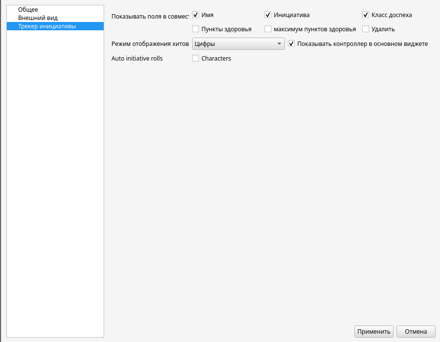

# DM-assist
A tool to assist dungeon masters in tabletop role-playing games

# Short Description
This tool originated from the idea that it's inconvenient to make several clicks to switch music during a tabletop RPG session.
Gradually, the project gained new features, eventually evolving into a more convenient, modern, and intuitive alternative to
DM helper.

# Table of Contents
- [Support](#support)
- [Installation](#installation)
- [Tutorial](#tutorial)
  - [Settings](#settings)
  - [Music](#music)
  - [Initiative Tracker](#initiative-tracker)
  - [Map](#map)
  - [Campaigns](#campaigns)
  - [Character Editor](#character-editor)
- [Planned Features](#planned-features-and-supported-game-systems)

# Support
- Windows 10
- Linux (built for Ubuntu)

# Installation
Go to the [releases](https://github.com/Technohamster-py/dm-assist/releases) page, choose the desired version
(latest stable version is recommended), and download the installer (for Windows) or tar.gz archive (for Linux).

For the installer, run the file and follow the instructions. For the archive, extract it to a chosen folder and run
the DM-assist executable.

# Tutorial:
## Settings
Settings can be accessed via the menu panel `Campaign -> Settings` or by using the shortcut `ctrl+alt+s`

### General

- **Language** determines the localization of the application. Russian and English versions are available out of the box. You can download localization file [here](https://github.com/Technohamster-py/dm-assist/issues/42)  
[How to add a new localization](https://github.com/Technohamster-py/dm-assist/wiki/Loacalisation)
- **Audio output** determines the device that will play music from the players.
Using a [virtual cable](https://vb-audio.com/Cable/), you can connect the audio output to the Discord microphone and 
broadcast music during an online game.
- **Working directory** determines where temporary files needed by the program will be stored.

### Appearance

- **Theme** sets the application theme. Click _browse_ to choose a new, non-default theme in XML format.
The file will be copied into the program's folder and will later be available in the settings menu.
- **Style** defines the style of rendering graphical interface elements. **_ Recommended style is fusion_**
- **Token name mode** and **Token font size** are responsible for the mode and parameters of drawing signatures with the names of characters on the map (for more information, see [Tokens](#using-tokens))

### Initiative Tracker

- **Shared fields** – determines which tracker fields are shown in the player window.
[details](#shared-access)
- **HP display mode** – defines how character health is shown in the player window
[details](#hp-display-modes)

## Music
Press ▶ to start playback. You can also use the shortcut `ctrl + playlist_number`. The number is shown to the left of the playlist name for convenience.

Each playlist can have its volume adjusted independently using its individual slider. Additionally, you can adjust the overall volume using the large slider below all players.

Click 🖊 to open the playlist editing window. Here, you can set the display name, add (+), delete (select and press -), and reorder (drag and drop) tracks.
After closing the dialog, selected files are copied to the program’s working folder. This folder is cleared when the program is closed.

## Initiative Tracker

Column descriptions:
- The currently active character is highlighted.
-  - initiative column
-  - armor class column
-  - current HP column

You can enter simple arithmetic expressions in the HP column to ease calculations. They are evaluated once the cell loses focus.

 -> 

Controls:
- Press  or  to move to the next or previous character. You can also use `PageUp` and `PageDown`.
- Press  to save the current encounter as an XML file.
- Press  to load an encounter from a file **_replacing the current one_**.
- Press **sort** to sort characters by initiative.
- Press **Add** to add a new character to the encounter.
- Press  to **_append_** a saved encounter to the current one.
- Use the dropdown list to set the HP display mode in the shared view.
- Press  to open the shared access window.

### Shared Access
Press  to open the shared tracker window

This is a pop-up widget to show the tracker to players. You can configure visibility of each column.

### HP Display Modes
In the shared view window, HP can be displayed as:
- Numeric (classic)
- Text status (Good / Injured / Dead)
- Progress bar

## Map

To open a new map, click the corresponding button if no maps are open, or click **+** to the right of all map tabs. To add a map to a campaign, use the menu `Campaign -> Add -> Map`.

You can open any jpg, png, bmp image or the custom dam (DM-assist map) format.

Tools are described below. Press `esc` to deactivate any tool.

Move the map using LMB with no active tool, or MMB with an active tool. Zoom with the mouse wheel.

The map is automatically saved in dam format on close if it was opened as part of a campaign.
You can also manually save it by right-clicking the tab and choosing **_Save_**.

### Shared Access
To open a viewer window for players, right-click the map tab and choose **_Share_**.
This window is view-only and doesn't allow scene editing. All actions from the main window are synced here.

### Ruler
A key tool for measuring distances.

Right-click  and choose **Calibrate**.
Click twice on the map to mark a segment, then enter the distance in the dialog.

After calibration, the ruler automatically enters measurement mode.

Click twice on the map to show distance.

To delete lines or text, right-click them with the ruler tool active.

### Fog of War
To add fog, use , to remove use . Change brush size with `ctrl + SCROLL`.
You can hide or reveal the whole map by right-clicking the respective fog button and choosing **Hide all** or **Reveal all**.

### Light

The _light_ tool  adds light sources to the map. Drag existing sources with this tool to move them.

Adjust light radius using spinboxes. Light scales according to ruler calibration.

Click  to change color.

Check **_update fog_** so fog is automatically cleared when placing or moving lights.

Right-click a light source with the tool active to delete it.

### Effect Shapes

The _shapes_ tool lets you draw spell areas on the map.

Each shape (line, circle, triangle, square) is drawn with two clicks. The first sets the origin point, the second defines size/distance.

Shapes follow [area of effect rules](https://dnd.su/articles/mechanics/157-spellcasting/#areas-of-effect) from D&D.

After the first click, a dynamic preview of the shape appears for convenience:
- Radius for circles
- Length for lines
- Height for triangles
- Edge length for squares

To change color, click  in the drawing section.

Right-click a shape to delete it.

### Brush

The _brush_ tool  allows freehand drawing on the map.

Brush color is synchronized with the effects tool. You can adjust opacity using a slider.

Use `ctrl + SCROLL` to change brush size (similar to fog tool).

Right-click a drawn line to delete it.

### Grid

A square or hexagonal grid can be applied to the map. The mode is selected by switching the drop-down list.

Next to the drop-down list, you can control the size of the grid cells.

## Campaigns
Campaigns allow you to store maps, characters, encounters, and playlists together and load everything at once.

### Creating a New Campaign
Select the menu `Campaign -> New` or press `ctrl + N`.

In the dialog, enter a name and project folder. The folder must be empty or not exist (the app will create it).

The campaign opens automatically after creation.

### Opening an Existing Campaign
Choose `Campaign -> Open` or press `ctrl + O`.

In the file dialog, select the root campaign folder (containing `campaign.json`).

### Working with a Campaign
Playlists are automatically set when the campaign opens. All music-related work will be saved with the campaign on exit.

A navigation tree appears on the left side.

Hovering over an element shows interaction buttons.

- Click  on a character to add them to the current encounter or
   to open the [editor](#character-editor).

- Click  on an encounter to add it or
   to replace the current one.

- Click  on a map to open it in the main window.

To add files to a campaign, place them in the correct subfolder. Each file type must be in its specific folder.

After adding new files, reload the campaign via `Campaign -> Reload from disk`.

To move a campaign, just move the whole folder to a new location.

### Using tokens
To add a character token to the map, drag its element from the campaign tree onto the open map. If the character image has already been downloaded and is located in the campaign `Tokens` folder, it will be applied. If the image is missing, a stub will be applied.

If the grid is enabled on the map, the token will be magnetically attached to it.

For tokens, you can change the display mode and font size of the name signature in [settings](#appearance). There are 3 display options in total
- Always display
- Display on hover in a suggestion
- Do not display

By right-clicking on the token, a context menu is opened, from which you can
- Add a character to the encounter
- Open the character editor
- Change the token size
- Remove the token from the card

## Character Editor
Character files use a format compatible with [LSS](https://longstoryshort.app/).

Note: Compatibility is one-way. Characters created here may not work in LSS.

To open a character sheet, click  in the campaign tree.

All stat bonuses, attack bonuses (except damage), and abilities are calculated automatically based on inputs.

Use the table to edit resources (spell slots, Ki points, etc.).
Click the **_refill_** cell to toggle recovery mode (short/long rest).

Restore resources by pressing the short or long rest button.

Click **Add** next to a table to add a new resource or attack.

Click an attack to edit it.

Use `ctrl + B`, `ctrl + I`, and `ctrl + U` for bold, italic, and underline formatting in note fields.

# Known Issues:
- It is not recommended to use any style other than Fusion (the default) or Windows 11 with the dark theme.
  Windows styles currently cause incorrect rendering.

# Planned Features and Supported Game Systems
## D&D 5e
- Extended initiative tracker
- Character storage
  - Fast level-up with feature selection per level
  - Multiclass support
## D&D 2024
## Call of Cthulhu
## Cyberpunk (RED, 2020)
## World of Darkness (MtA, VtM etc.)
## Pathfinder
## Starfinder
